# moltek

**An AI music studio.** Ask for a track, and the agent writes it, plays it, listens
back to what came out, and mixes it. You sit at the desk and tell it what you want
changed.

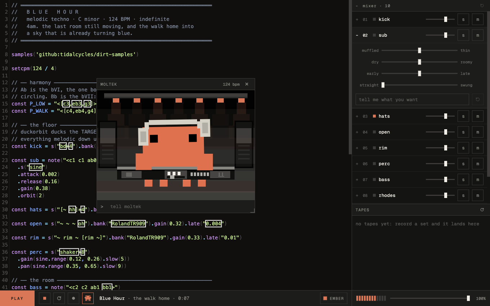

You talk to it the way you would talk to a producer. Play me something slow and
hypnotic. Make the bass darker. That hi-hat is too busy. Give the whole thing more
room. It makes the change, plays it back, and you say what you think.

## What makes it different

Plenty of things can generate a piece of music. Almost none of them can tell
whether what they made is any good, because they never hear it. moltek can, and
that changes what it's able to fix.

**It checks the track before you ever hear it.** Some mistakes in music software
are silent: a chord that doesn't exist plays nothing at all, and a part told to
duck out of the way of the drums can end up flattening the drums instead. Both look
completely fine. moltek plays the track through to itself first, in silence, and
catches those before they reach your speakers.

**It listens to the result.** Once a track is running, it records a few seconds of
its own output and measures it, the way an engineer would: how loud it is, whether
the low end is swallowing everything, how wide it sits, whether it's clipping, how
the energy moves. It also works out the tempo and the key from the audio itself,
which means it can notice when the track isn't in the key it thought it was.

**It takes direction.** Every part of the track gets its own channel, and you can
type at any one of them.

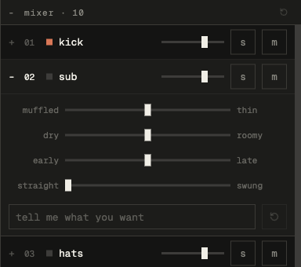

Tell the bass it's too muddy and that note reaches the agent knowing which part you
meant, which version was playing, and where in the track you were. It gets a note
about a specific bar, not a vague complaint about the whole song.

Each channel also has a volume fader and four feel controls: dull to bright, dry to
roomy, early to late, straight to swung. They sit on top of what the agent wrote
rather than editing it, so the middle always means "leave it alone" and nothing you
touch here quietly rewrites the music.

## Recording

Press record and it captures what's playing. You get to listen before deciding
whether to keep it, and keeping it saves the audio to your computer. The agent can
record too, which is how it grabs a clip to listen back to.

## Eight looks

Pick one in the bottom bar. The mascot belongs to the theme, so he changes with
everything else.

| | | | |
|:-:|:-:|:-:|:-:|
| 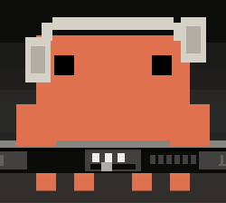 | 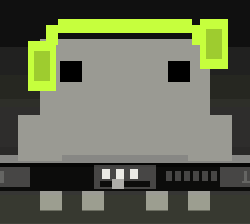 | 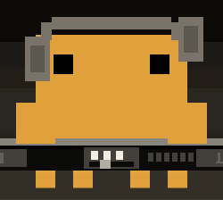 | 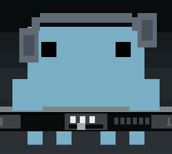 |
| ember | concrete | sodium | steel |
| 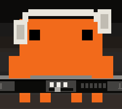 | 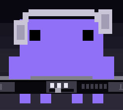 | 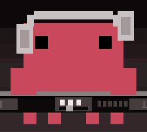 | 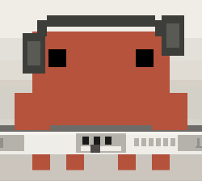 |
| hazard | uv | oxblood | bone |

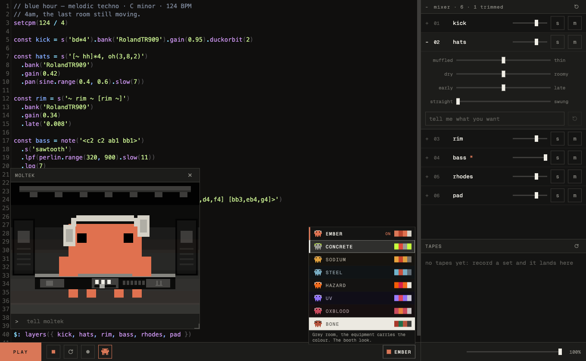

Each one is tested to make sure the text is actually readable and the mascot
doesn't vanish into the background, so a theme that looks bad never ships.

## Try it

You need [Node.js](https://nodejs.org) and [pnpm](https://pnpm.io) installed. Then,
in a terminal:

```
pnpm install
pnpm dev
```

Open `localhost:3000` in your browser, open your AI coding assistant in the same
folder, and ask it for a track. It works out of the box with Claude Code; anything
else needs a little setup, covered in the reference below.

Nothing is hidden, by the way. The music is real, readable code sitting in the
editor, and you can change it yourself whenever you like. You do not have to.

## Rebuilding a song

Point moltek at a record and get an editable track back:

```bash
node scripts/rebuild.mjs <url-or-file>
```

It fetches the audio, splits it into stems, measures the tempo, key and section
boundaries, transcribes drums, bass, sub, chords and a lead, then writes a
moltek track you can open and change. Everything lands in `.moltek/rebuilds/`.

Nothing in the output is carried over from another song. Tempo, key, chords,
reverb and filter amounts, sidechain depth and the lead's voice are each
measured from the record in front of it, and where a value can't be measured
it's a labelled default with the reasoning next to it. The pipeline errs toward
silence: a layer it can't recover from its own rendering gets dropped instead of
emitted, and a section only gets chords when there's real polyphonic evidence
for them.

Needs `ffmpeg`, `yt-dlp` and `demucs` on your PATH; the command tells you how to
install whichever is missing. Basic Pitch is optional and improves note
transcription when present.

Two things worth knowing before the first run. Stem separation is slow and
downloads a model of about 2GB the first time, so expect a wait even once
everything is installed. And the run reaches the network: it fetches the audio
from whatever site you point it at, and it asks Deezer, MusicBrainz and
AcousticBrainz for a known tempo and key to cross-check its own reading. A local
file skips the download but still does the lookups. YouTube, SoundCloud and
Bandcamp go through `yt-dlp`; any other link is treated as a direct audio
download; Spotify is refused with an explanation. What you fetch, and whether
you have the right to, is your call.

**The lead is approximate.** Pulling a melody out of a stem that still holds
pads and keys is beyond what open tooling does reliably today: measured against
a track with known notes, the best of seven approaches lands at 15.4% exact
notes. The register, rhythm and timbre are right; the specific notes usually
aren't. Emitted tracks say so in a comment above that layer, because it's the
first thing worth editing by ear.

Drums, tempo, structure and harmony hold up better. Even so, the clone won't
sound like the record, and dense material transcribes far worse than sparse
electronic music.

The command is `node scripts/rebuild.mjs` or `pnpm run rebuild` — bare `pnpm
rebuild` collides with pnpm's own built-in rebuild command and does not work.

## Under the hood

The music engine is [Strudel](https://strudel.cc), an excellent open source project
for writing music as code. moltek is the studio built around it: the mixer, the
recording, the listening, and everything the agent needs to work on a track without
someone watching over it.

If you want the technical side, the endpoints, the commands, using your own
samples, and how to wire up an assistant other than Claude Code, it's all in
**[the reference](docs/REFERENCE.md)**.

## Credits and licence

moltek continues [strudel-claude](https://github.com/renatoworks/strudel-claude) by
Renato Costa, which was MIT licensed.

moltek is licensed **AGPL-3.0-or-later**, because Strudel is AGPL and moltek builds
on it. In plain terms: use it, change it, build on it. If you hand it to other
people or run it as a service, share your changes too.

The mascot is based on the character Anthropic uses for Claude Code, and that
design is theirs. This project is not affiliated with or endorsed by Anthropic.
Claude and Claude Code are their trademarks, mentioned here only to say which
assistant works without setup.
