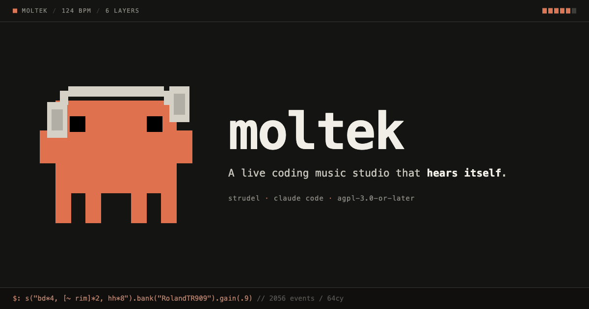

# moltek



**A live coding music studio that hears itself.** Write patterns in
[Strudel](https://strudel.cc), push them from Claude Code, and the agent records
its own output, reads back the mix, and fixes what's wrong.

Most agent-driven music tools can tell you the code ran. This one can tell you
the bass is muddy, the pad is ducking the kick instead of the other way round,
and that the chord you wrote voices to silence. That is the whole point of it.

## Why it's different

**It refuses to lie about whether the code worked.** Pushing waits for the
browser to evaluate and reports the verdict, so `OK: playing` means the pattern
is running, not that a request was accepted.

**It catches faults that make no noise.** Some failures raise no error and still
ruin a track. Strudel's `.voicing()` speaks jazz shorthand, so a
plausible-looking `Cmaj7` is not in its dictionary and voices to silence.
`.duckorbit(n)` ducks orbit `n` rather than the layer carrying it, so a pad
written for a sidechain punches the kick instead. Code like that pushes cleanly,
plays without complaint, and measures fine. `check.mjs` evaluates a track
headlessly and inspects the events it would actually produce:

```
FAIL my-track.js  (2056 events/64cy · 120 BPM · 6 layers)
     ERROR [silent-chord] chord "Fmaj7" is not in Strudel's dictionary - it voices to SILENCE
           -> use "F^7" or "FM7"
     ERROR [duck-self] "gm_epiano1" ducks orbit 1, which is its own bus (298 events)
           -> duckorbit ducks the TARGET orbit. Put .duckorbit(N) on the kick
```

It also reports per-sound levels and flags default-gain bass, low-mid pile-ups,
missing sample packs, and sections that repeat bit-for-bit. `pnpm push` runs it
first and refuses to push on errors.

**It has ears.** Pushing code only proves it ran. The analysis scripts record a
clip of the live output and read back loudness, dynamics, frequency balance,
stereo width, clipping and an energy arc, plus the musical content: measured
tempo with onset density, and the key the sounding notes belong to. State your
intent and let the measurement disagree with you.

```bash
node scripts/listen.mjs 12                                    # record 12s of what's playing
node scripts/analyze.mjs tape.wav --expect-bpm 124 --expect-key "F minor"
```

**It hears you too.** The console's note inputs send free text aimed at a named
layer or the whole track, stamped with the revision and the section playing at
that moment, so the agent gets "the bass in the drop is too muddy" instead of
guessing. Solo and mute travel the same way, so the agent can isolate a layer
over the API and listen to exactly what you're listening to.

## Quick start

You need [Claude Code](https://docs.anthropic.com/en/docs/claude-code), Node.js
and [pnpm](https://pnpm.io).

```bash
pnpm install
pnpm dev          # studio at http://localhost:3000
claude            # in the project folder
```

Then just ask:

```
"Teach me Strudel"           -> /tutorial
"Play me a techno set"       -> /dj-set
"Compose a synthwave track"  -> /compose
"Let's make music together"  -> /interactive
```

`Cmd+Enter` evaluates, `Cmd+.` stops.

## What is Strudel?

A JavaScript port of TidalCycles for algorithmic composition. Write code, get
music, live.

```javascript
$: s("bd*4, [~ rim]*2, hh*8").bank("RolandTR909")
$: note("<c2 eb2 f2 g2>").s("sawtooth").lpf(400)
```

## The studio

Code stays front and centre, because that's the instrument. A rack down the
right holds the layer mixer over the tape deck, and all the chrome sits in a
flat terminal-style strip along the bottom. Both the rack's width and the split
between mixer and tapes drag to whatever you want.

The bottom strip carries transport, the current section and elapsed time, a
segmented master meter and the master fader, with the note inputs on the last
line as the channel back to the agent.

Tracks are written as named layers, which is what makes the mixer possible:

```javascript
layers({ kick, bass, rhodes, pad })
```

Every layer gets a row with an activity light, a volume fader, solo and mute.
Solo stacks, so you can hold the kick and the bass up together and hear how they
sit. Click a row and four feel knobs unfold under it, muffled to thin, dry to
roomy, early to late, straight to swung, with a reset and a note box. Click again
to fold them away, and the mixer header folds the whole rack down to one line the
same way.

Every one of those controls is a **trim on top of what the code says**, so centre
always means as-written and nothing is silently rewriting your patterns. Volume,
tone and space apply live without stopping playback. The two timing controls have
to rebuild the pattern, so they re-evaluate when you let go rather than under
your finger.

The mascot is its own small window, draggable and resizable, and it dances to
whatever is actually playing.

Server state and revision history persist to `.moltek/state.json`, so a restart
doesn't lose the working track. Playback never auto-resumes, deliberately.

## Recording

Hit play, then the red record button. It pulses and shows duration. Click again
to stop and a review row appears so you can listen before keeping or discarding.
Keeping downloads the WAV through your browser.

The agent can record too, over `/api/record/start` and `/api/record/stop`, and
those takes are saved server-side into `recordings/` where the analysis scripts
and `/api/recordings` can reach them. So: takes you start by hand come to you as
a download, takes the agent starts land in the project. If playback stops
mid-recording the take finishes rather than capturing silence.

## Skills

Claude auto-invokes `/strudel` and `/api` whenever it makes music, so the syntax
and the transport are always at hand. The rest you ask for:

| Skill | What it does |
|---|---|
| `/tutorial` | Learn Strudel and music theory by doing |
| `/dj-set` | Live sets that evolve over time |
| `/compose` | Full tracks with arranged structure |
| `/interactive` | Build something together, step by step |
| `/tracks` | Save to `tracks/` and replay later ("play acid bloom again") |
| `/theory` | Scales, progressions, borrowed chords, song arcs |
| `/humanize` | Swing, ghost notes, fills, drift, width, gain staging |
| `/visuals` | Pianoroll, spiral, oscilloscope |

## Scripts

| Command | What it does |
|---|---|
| `pnpm check <file>` | Evaluate headlessly, report silent chords, bad routing, mix problems |
| `pnpm push <file> [--play]` | Check, then push; `--play` waits for the eval verdict |
| `pnpm listen [secs]` | Record the live output and print a producer-grade analysis |
| `pnpm analyze [file]` | Analyse a WAV, newest recording if omitted |
| `pnpm share [file]` | Print a strudel.cc share link |
| `pnpm smoke` | API smoke test against the running server |
| `pnpm validate:tracks` | Check every saved track's structure, tempo, duration, content |

## API

Real-time sync over Server-Sent Events, so the browser updates the moment code
is pushed, and reports back, so the agent knows whether a push actually
evaluated or threw.

| Endpoint | Method | Description |
|---|---|---|
| `/api/code` | `GET` | Current code and revision. Edits made in the browser sync back automatically, on a short poll |
| `/api/code` | `POST` | Push code `{ code, play? }`, atomic push-and-play |
| `/api/play` | `POST` | Start playback. Repeat POSTs force re-evaluation |
| `/api/stop` | `POST` | Stop playback |
| `/api/status` | `GET` | Full state: eval results, connected clients, audio readiness, recording |
| `/api/gain` | `POST` | Master volume with ramp `{ level, rampMs }` |
| `/api/nowplaying` | `POST` | Now-playing metadata `{ title, artist, section }` |
| `/api/history` | `GET`/`POST` | List pushed revisions, restore one. Survives restarts |
| `/api/record/start` | `POST` | Start recording in the browser |
| `/api/record/stop` | `POST` | Stop recording; the WAV lands in `recordings/` |
| `/api/recordings` | `GET` | List saved recordings; `/api/recordings/<name>` streams one |
| `/api/mix` | `GET`/`POST` | Per-layer solo/mute `{ muted, soloed }` and per-layer trims `{ trim: { layer: "bass", volume: 0.5 } }`, applies live |
| `/api/notes` | `GET`/`POST`/`DELETE` | Listener feedback, optionally aimed at a layer |
| `/api/events` | `GET` | SSE stream |

Prefer the script over hand-rolled curl, since it handles escaping and waits for
the verdict:

```bash
node scripts/push.mjs my-track.js --play
```

## Samples

Drop WAV or MP3 files into `public/samples/` and register them with
`samples({ name: '/samples/file.wav' })`. Real instruments, field recordings,
your own hits. See `public/samples/README.md`.

Verified external packs, including a lofi drum crate with hundreds of one-shots,
classic breaks, sax, sitar, guitar, voices and textures, are catalogued for the
agent in the `/strudel` skill.

## Voice feedback

The agent speaks over macOS `say`, which is macOS only. The stock voices are
rough and the Siri voices are much better: System Settings, Accessibility, Spoken
Content, then the info button beside System Voice, search "Siri", download one
and set it as the system voice.

## Built on

Next.js, Tailwind, and [Strudel](https://github.com/tidalcycles/strudel)
(`@strudel/repl` bundled locally with a pinned CDN fallback). Worth reading:
[Strudel docs](https://strudel.cc/learn) and
[TidalCycles](https://tidalcycles.org).

## Credits and license

moltek continues development of
[strudel-claude](https://github.com/renatoworks/strudel-claude), created by
Renato Costa under the MIT License.

Licensed **AGPL-3.0-or-later**. Strudel is AGPL and moltek bundles it, so the
combined work carries the same terms: build on this freely, but if you ship it,
including as a hosted service, publish your source too. Full text in `LICENSE`,
attribution and notices in `NOTICE`.

The mascot is derived from the character Anthropic uses for Claude Code. The
character design is theirs. This project is not affiliated with, sponsored by, or
endorsed by Anthropic. Claude and Claude Code are their trademarks, referred to
here only to describe what moltek works with.
